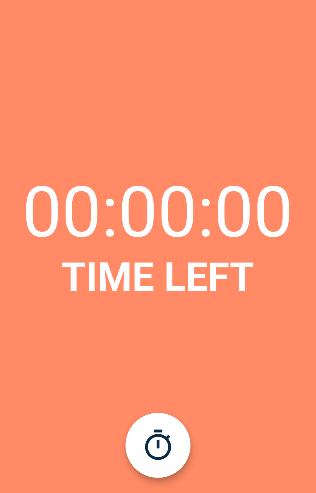
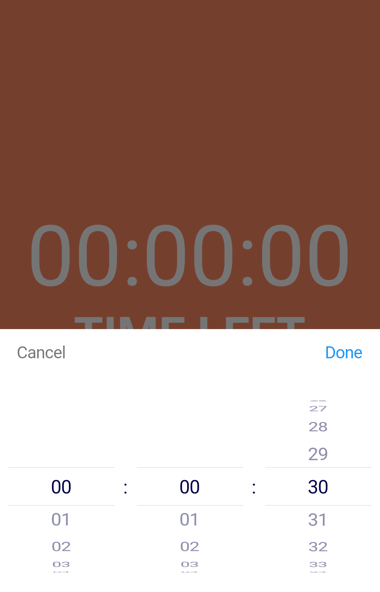
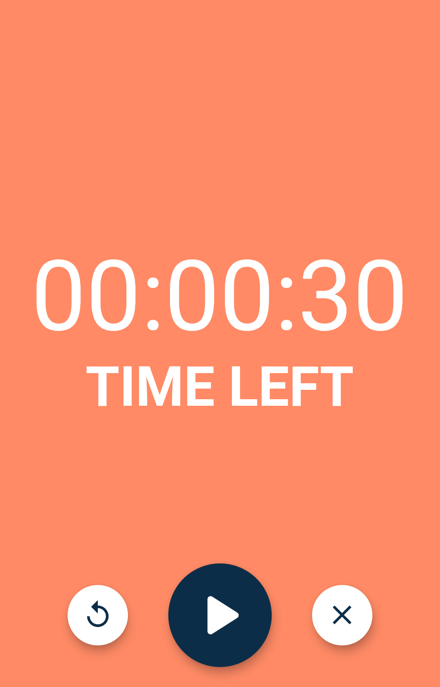
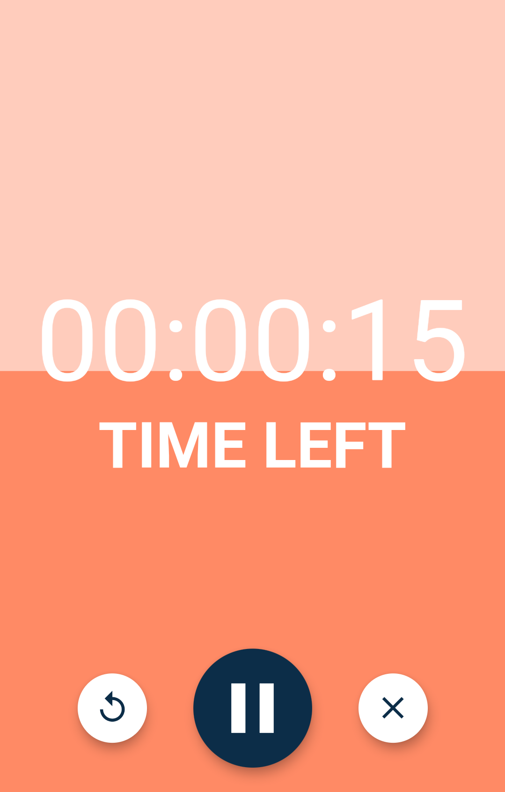
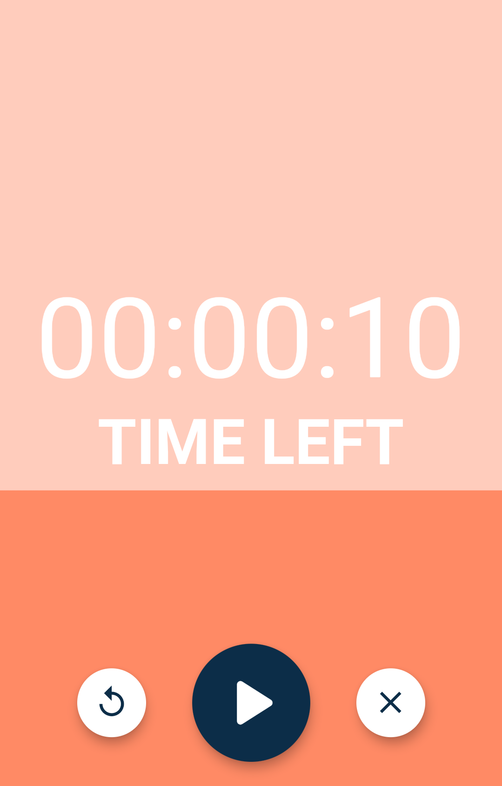

# CountDown Timer
Single page to create countdown timer with beautiful animation and tone after timer finished created by Flutter framework.

 

## Table of contents
* [General info](#general-info)
* [Technologies](#technologies)
* [Launch](#launch)
* [Setup](#setup)
* [Example of use](#example-of-use)

 
 

## General info
* You can set a countdown timer for some time with beautiful animations and attractive colors.
* You can control timer with player settings "Replay - Play/Pause - Cancel"

 

## Technologies
Project is created with:
* Dart as programming language
* Flutter as framework of Dart

 

## Launch
1. connect you real device / emulator (Android) / simulator (IOS)
1. open lib folder
2. run [main.dart](lib/main.dart)

 

## Setup
1. visit [Flutter](https://flutter.dev/docs/get-started/install "Flutter setup page")
2. choose your operating system
3. follow the instructions to install Flutter successfully
4. install [time picker package](https://pub.dev/packages/flutter_datetime_picker/install "DateTime Picker package installation")
5. install [audio player package](https://pub.dev/packages/audioplayers/install "Audio player package installation")

 

## Example of use
 

<ul>
  <li>
    <h5>Preview</h5>
    

    
  </li>
  <li>
    <h5>Initialization</h5>
    

    
  </li>
  <li>
    <h5>Readiness of Timer</h5>
    

    
  </li>
  <li>
    <h5>Running</h5>
    

    
  </li>
  <li>
    <h5>Pause</h5>
    

    
  </li>
</ul>